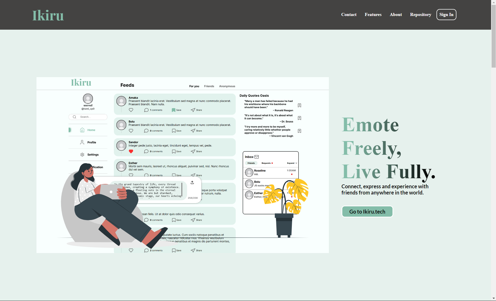

# Ikiru
> Japanese vocabulary: 生きる 【いきる】(ikiru) Meaning: to live.

A portfolio project to develop a place to express and experience. A non-toxic social media with very positive community where we help each other and collectively maintain our mental health.
Our user-friendly interface fosters seamless integration of APIs, data models, databases, authentication, and authorization. Built on a flexible, SOA/Three tier architecture.

Connect with friends from all over the world.
> **Note:** core Information and code snippets are not included in this README because the website is not yet completely public.

## Index

- [Ikiru](#ikiru)
  - [Index](#index)
  - [Usage](#usage)
  - [Features](#features)
  - [Technology and Architecture](#technology-and-architecture)
  - [Bugs](#bugs)
  - [Contibute](#contibute)
  - [Authors](#authors)
  - [Timeline and Vision](#timeline-and-vision)
  - [Future Plans](#future-plans)
  - [License](#license)

## Usage

> **Note:** The Website is currently only ready for desktop/PC devices.

**unfortunately our servers are down as of JULY 2024, so it cant be accessed online anymore**.

## Features

> Visit the [about](http://web-01.tamilore.tech/about) page of Ikiru to get a visually better feature explanation

- User Authentication
- Infinite Scrolling
- To post
- To see the posts of others in thier profile
- To see your posts in profile

> Those are the only features for MVP 1.0, wait for updates to get more features.

## Technology and Architecture

**Architecture**:
The Web Application employs a Three-Tier Architecture, mixed with a little bit of ***Service Oriented Architecture*** **(SOA)**. It's structured as:

> Presentation Layer: The user interface that users see and interact with.
> Application Layer: This layer contains our business logic and interacts with both the Presentation and Data layers.
> Data Layer: This layer houses our Database.

The touch of SOA is introduced through the development of a separate API for our frontend. This design choice enhances our application's flexibility, maintainability, and scalability.

Our custom built **Ikiru API** employs a variation of the Model-View-Controller Architecture. Here, the Model corresponds to the data in the database, the View is represented by the Swagger UI documentation we developed, and the Controller, which contains our application logic, is represented in the routes.

**Technologies**:

- Flask
- Python
- SQLAlchemy ORM
- MySQL
- HTML 5
- CSS
- JAVASCRIPT
- JQuery
- Flask-login
- IntersectionObserverAPI
- Bcrypt
- Flask-CORS
- Swagger UI
- Flassger
- UUID
- Datetime
- IkiruAPI
- zenquotesAPI
- Wtfforms
- Flask_wtf
- Gunicorn
- NginX

## Bugs

No known bugs at this time.

## Contibute

We welcome contributions from the community to help improve the project. If you encounter any bugs or have ideas for new features, please submit a bug report or feature request through the GitHub issues page or reach out to any of the emails in the [Authors](#authors) section. Additionally, we encourage pull requests for fixes or enhancements.

## Authors

- Oluwatamilore Olugbesan <findtamilore@gmail.com>
- Huclark Vanderpuye <vhuclark@gmail.com>
- Moses Solomon Ayofemi <solomonsyofemi@gmail.com>

## Timeline and Vision

This project started from ***April 12th, 2024*** and went on a temporary halt on the ***May 11th, 2024***.
This is the **first** major project of each member of the team after 9 Months in tech.
As newcomers, we're thrilled by our achievements within the given timeline. We embraced the challenge of learning new technologies on the fly, collaborated effectively despite being from diverse backgrounds, and thrived under the pressure of meeting deadlines set by the [ALX Software Engineering Program](https://www.alxafrica.com/). Our [vision](web-01.tamilore.tech/about/#about) for this project was to eliminate all toxicity and pressure that most social media fail to combat and ultimately have a very positive community where we help each other and collectively maintain our mental health.

## Future Plans

We have exciting plans for future enhancements and features in the pipeline. Some of the planned improvements include chatting, anonymous posting and  image posting. Stay tuned for updates as we continue to evolve and enhance the app to better serve our users.

## License

This project is licensed under the [Creative Commons Attribution-NonCommercial-NoDerivatives 4.0 International License](https://creativecommons.org/licenses/by-nc-nd/4.0/).

For details, please see the [LICENSE](LICENSE) file.
